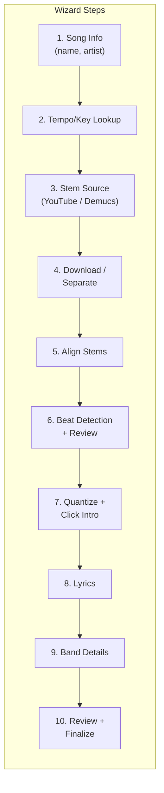

# New Song Wizard

> Build a multi-step web UI wizard in the Django app that automates adding new songs: searching YouTube for stems (with Demucs fallback for AI separation), downloading audio, aligning stems interactively, detecting and adjusting beats, quantizing to a fixed tempo with a click intro, fetching lyrics with offset, looking up tempo/key, and collecting manual band metadata -- all from a step-by-step interface.

## Architecture Overview

A new multi-step wizard accessible from the sidebar (staff only), backed by a Django model that persists wizard state across steps. Long-running operations (downloads, beat detection, quantization) run in background threads with AJAX polling for progress. All processing happens in a staging directory; final files are moved to `SONGS_DIR` on completion.



## New Dependencies

Add to `requirements.txt`:

- **yt-dlp** -- YouTube search and audio download
- **librosa** -- beat tracking, onset detection, tempo estimation (pulls in `numpy`, `scipy`, `soundfile`)
- **pyrubberband** -- high-quality time-stretching (Python bindings for Rubber Band Library)
- **demucs** -- Meta's AI stem separation model (splits a mix into vocals, drums, bass, guitar, keys). Pulls in `torch`; the `htdemucs_6s` model is the 6-stem variant needed here.
- System dependency: **rubberband-cli** (`brew install rubberband` on macOS, `apt install rubberband-cli` on Debian) -- required by pyrubberband

Note: `demucs` + `torch` is a large dependency (~2 GB). It can be made optional -- the wizard detects whether it's installed and only shows the Demucs option if available.

No task queue (Celery, etc.) needed. Background work uses `threading.Thread` with progress stored in the DB, polled via AJAX -- consistent with existing vanilla Django patterns.

## Data Model

New model in `player/models.py`:

```python
class SongWizard(models.Model):
    STEP_CHOICES = [
        ('song_info', 'Song Info'),
        ('tempo_key', 'Tempo/Key Lookup'),
        ('stem_source', 'Stem Source'),
        ('download', 'Download / Separate'),
        ('align', 'Align Stems'),
        ('beat_detect', 'Beat Detection'),
        ('quantize', 'Quantize + Click'),
        ('lyrics', 'Lyrics'),
        ('band_details', 'Band Details'),
        ('review', 'Review'),
        ('complete', 'Complete'),
        ('failed', 'Failed'),
    ]
    created_by = models.ForeignKey(settings.AUTH_USER_MODEL, on_delete=models.CASCADE)
    current_step = models.CharField(max_length=20, choices=STEP_CHOICES, default='song_info')
    title = models.CharField(max_length=255)
    artist = models.CharField(max_length=255)
    tempo = models.IntegerField(null=True, blank=True)
    key = models.CharField(max_length=20, blank=True, default='')
    time_signature = models.CharField(max_length=10, default='4/4')

    # How stems were sourced: 'youtube', 'demucs', or 'mixed'
    stem_source = models.CharField(max_length=20, default='youtube')

    # YouTube selections stored as JSON
    # e.g. {"guitar": {"video_id": "...", "title": "..."}, "bass": {...}, ...}
    stem_selections = models.JSONField(default=dict, blank=True)
    master_selection = models.JSONField(default=dict, blank=True)

    # Per-stem alignment offsets in seconds (positive = shift right / delay)
    # e.g. {"Guitar": 0.12, "Bass": -0.05, "Vocals": 0.08, "Drums": 0.0}
    stem_offsets = models.JSONField(default=dict, blank=True)

    # Beat detection results: list of beat times in seconds
    detected_beats = models.JSONField(default=list, blank=True)
    adjusted_beats = models.JSONField(default=list, blank=True)

    # Band details (guitars, vocals, starts, etc.)
    band_details = models.JSONField(default=dict, blank=True)

    # Lyrics
    lyrics_content = models.TextField(blank=True, default='')
    lyric_offset_secs = models.FloatField(default=0)

    # Background task tracking
    bg_task_status = models.CharField(max_length=20, default='idle')  # idle, running, done, error
    bg_task_progress = models.IntegerField(default=0)  # 0-100
    bg_task_message = models.TextField(blank=True, default='')

    staging_dir = models.CharField(max_length=500, blank=True, default='')
    created_at = models.DateTimeField(auto_now_add=True)
    updated_at = models.DateTimeField(auto_now=True)
```

Staging files go in a new `STAGING_DIR` setting (default `<project>/.song_staging/<wizard_id>/`).

## Wizard Steps in Detail

### Step 1: Song Info

- Simple form: title, artist, time signature (default 4/4)
- Creates the `SongWizard` record

### Step 2: Tempo/Key Lookup

- **Primary source**: Spotify Web API (`/v1/search` to find the track, then `/v1/audio-features/{id}` for tempo + key + time signature). Requires `SPOTIFY_CLIENT_ID` / `SPOTIFY_CLIENT_SECRET` env vars (client credentials flow, no user OAuth).
- **Fallback**: GetSongBPM.com API (simpler, API key based) or local detection via `librosa.beat.beat_track()` and `librosa.key_to_notes()`
- Display results with editable fields so the user can override
- If no API keys configured, skip straight to manual entry

### Step 3: Stem Source Selection (YouTube or Demucs)

Two paths, chosen by the user:

**Path A -- YouTube stems:**

- For each stem type (Drums, Bass, Guitar, Vocals), search YouTube using `yt-dlp`'s search:
  - `"{artist} {title} drums isolated"`, `"... drums stem"`, `"... drums only"`
  - Same pattern for bass, guitar, vocals
  - Additional keyword variants: "backing track", "multitrack", "acapella" (for vocals)
- Also search for the master: `"{artist} {title} official audio"`, `"... official music video"`
- Display a card per stem type, each showing top 5 YouTube results (thumbnail, title, duration, channel)
- User selects one video per stem (or marks a stem as "skip")
- User selects the master track
- Store selections in `stem_selections` / `master_selection` JSON fields

**Path B -- Demucs AI separation:**

- User searches for / selects just the master track from YouTube (or uploads one)
- After master is downloaded, run Demucs `htdemucs_6s` model to split into 6 stems: vocals, drums, bass, guitar, other/keys
- Background thread with progress (Demucs logs progress per step)
- Output: `staging_dir/Vocals.wav`, `Drums.wav`, `Bass.wav`, `Guitar.wav`, `Keys.wav`, `Master.wav`
- Demucs option is only shown if `demucs` is importable (graceful degradation)

**Mixed mode:** User can start with YouTube stems and fall back to Demucs for any stems they couldn't find (e.g., found drums and vocals on YouTube but not bass -- run Demucs on the master and use its bass output).

### Step 4: Download / Separate

- **YouTube path**: Use `yt-dlp` to download audio from selected videos. Format: best audio, post-process to WAV. Save as `staging_dir/Drums.wav`, `Guitar.wav`, etc.
- **Demucs path**: Download master, then run `demucs --two-stems` or full 6-stem separation
- Background thread with progress updates (per-file percentage for downloads, model progress for Demucs)
- UI shows a progress bar per stem

### Step 5: Stem Alignment

YouTube-sourced stems almost certainly have different amounts of leading silence and won't be time-aligned. This step lets the user drag each stem into alignment against the master.

- **Multi-waveform alignment UI**:
  - Stacked horizontal waveforms: Master (fixed, reference) on top, each stem below
  - Each stem waveform is **horizontally draggable** -- user slides it left/right to adjust its offset relative to the master
  - Offset displayed in milliseconds next to each stem (also editable as a number input for precision)
  - **Playback controls**: play/pause with all stems mixed, plus solo/mute toggles per stem so the user can audition one stem against the master to check alignment
  - Zoom in/out for fine-grained alignment (sample-accurate at high zoom)
  - Visual alignment aids: vertical cursor line synced across all waveforms
  - "Auto-align" button (stretch goal): cross-correlate each stem with the master to estimate the best offset automatically
- For Demucs-sourced stems, offsets default to 0 (they're inherently aligned since they came from the same master) -- this step can be skipped or confirmed quickly
- Save per-stem offsets (in seconds) to `stem_offsets` JSON field
- When proceeding, stems are trimmed/padded to apply offsets, producing aligned WAV files in staging

### Step 6: Beat Detection + Review

- Run `librosa.beat.beat_track()` on the drums stem (or master if no drums)
- Store detected beat times as a JSON array of float seconds
- **Interactive beat editor UI**:
  - Canvas-based waveform of the drums stem (reuse existing waveform rendering pattern from `player/static/player/js/player.js`)
  - Vertical beat markers overlaid on the waveform at detected positions
  - Drag markers left/right to adjust timing
  - Click between markers to add a new beat
  - Right-click or shift-click to delete a marker
  - Play/pause to audition with a click sound on each marker
  - "Re-detect" button to re-run detection if results are poor
  - Beat numbers and measure groupings shown (e.g., every 4 beats highlighted for 4/4)
  - Zoom in/out for fine adjustment
- Save adjusted beats back to the model

### Step 7: Quantize + Click Intro

- **Quantization**: For each stem + master:
  - Split audio at adjusted beat boundaries into segments
  - Calculate each segment's actual duration vs. target duration (beat interval = 60/tempo)
  - Time-stretch each segment using `pyrubberband.pyrb.time_stretch()` to match target tempo
  - Concatenate the warped segments
  - **Prepend silence**: add exactly `click_intro_duration` seconds of silence to the start of every stem and the master (so all tracks start at 0:00 but the music begins after the click intro)
- **Click track generation**: Generate `Click.ogg` that is the full song duration (including intro):
  - 8 beats of audible click during the intro (2 bars of 4/4 at the target tempo)
  - Accented click (higher pitch, e.g., 1000 Hz) on beat 1 of each bar, normal click (800 Hz) on beats 2-4
  - Continue the click through the entire song (so musicians can hear the grid while playing)
  - Render as OGG Opus using ffmpeg (consistent with the existing lossy audio pipeline)
- Background thread with progress (per-stem)
- Output: quantized WAV files + `Click.ogg` in staging directory
- UI shows before/after playback comparison

### Step 8: Lyrics

- Reuse logic from `download_lyrics.py` (`search_lyrics()` function) to query LRCLIB
- Display synced lyrics in a text area for review/edit
- Auto-calculate lyric offset from the click intro: `click_intro_duration = (beats_per_bar * bars_of_intro) * (60 / tempo)`
  - For 4/4 with 2-bar intro: `8 * (60 / tempo)` seconds
- Apply offset to all LRC timestamps automatically
- User can adjust offset manually
- The `lyric_offset` field in `info.json` gets set to this value

### Step 9: Band Details

- Form matching the existing `info.json` structure:
  - **Guitars**: lead (type, tuning, capo), rhythm (type, tuning, capo), bass (tuning)
  - **Vocals**: lead (multi-select from band members), backing (multi-select)
  - **Starts**: who starts the song, what they start with
- Band member names should be configurable (stored in `SiteSettings` or a new model, prepopulated from existing songs)

### Step 10: Review + Finalize

- Summary of everything: title, artist, tempo, key, stems list, lyrics preview, band details
- Playback preview of the final quantized + aligned stems with click track
- "Create Song" button:
  - Generates `info.json` from all collected metadata (including `lyric_offset`)
  - Writes `lyrics.lrc` with offset applied
  - Copies quantized audio files + `Click.ogg` to `SONGS_DIR/{Artist} - {Title}/`
  - Cleans up staging directory
  - Marks wizard as `complete`
- Redirect to the new song's player page

## URL Structure

All under `/songs/new/` prefix, staff-only:

- `/songs/new/` -- start wizard (or resume in-progress)
- `/songs/new/<wizard_id>/step/<step_name>/` -- each step page
- `/api/songs/new/<wizard_id>/youtube-search/` -- AJAX: YouTube search
- `/api/songs/new/<wizard_id>/download/` -- AJAX: start download
- `/api/songs/new/<wizard_id>/demucs/` -- AJAX: start Demucs separation
- `/api/songs/new/<wizard_id>/stem-offsets/` -- GET/PUT stem alignment offsets
- `/api/songs/new/<wizard_id>/stem-audio/<stem_name>/` -- serve staging audio for playback in alignment/beat editor
- `/api/songs/new/<wizard_id>/detect-beats/` -- AJAX: start beat detection
- `/api/songs/new/<wizard_id>/quantize/` -- AJAX: start quantization
- `/api/songs/new/<wizard_id>/task-status/` -- AJAX: poll background task progress
- `/api/songs/new/<wizard_id>/beats/` -- GET/PUT beat positions

## UI / Navigation

- New "Add Song" button on the song list page (staff only), like the existing ZIP upload but routes to the wizard
- New sidebar item or sub-item under existing navigation
- Wizard uses a stepped progress indicator at the top (step 1 of 10, with step names)
- Each step has Back / Next navigation
- Consistent with existing dark theme and CSS patterns in `player/static/player/css/style.css`

## File Structure (new files)

- `player/wizard_views.py` -- all wizard views (keeps `views.py` from growing further)
- `player/wizard_services.py` -- business logic: YouTube search, download, Demucs, beat detection, quantization, click generation, lyrics
- `player/templates/player/wizard/` -- templates for each step
- `player/static/player/js/beat_editor.js` -- interactive beat editor component (Canvas waveform + draggable markers)
- `player/static/player/js/stem_aligner.js` -- interactive stem alignment component (stacked waveforms with drag offsets + solo/mute)
- `player/static/player/js/wizard.js` -- wizard UI logic (progress polling, step navigation)

## Implementation Phases

Given the complexity, this should be built incrementally. Each phase produces a working subset:

- **Phase A**: Foundation + Steps 1-2 (model, migration, wizard shell with step indicator, song info form, tempo/key lookup via Spotify or manual)
- **Phase B**: Steps 3-4 (YouTube search UI, stem selection cards, Demucs option with graceful fallback, background download/separation with progress)
- **Phase B2**: Step 5 (interactive stem alignment -- stacked waveforms with drag offsets, solo/mute, playback against master)
- **Phase C**: Step 6 (beat detection + interactive beat editor -- the hardest frontend work)
- **Phase D**: Step 7 (quantization engine, silence prepend on all stems, Click.ogg generation -- the hardest backend work)
- **Phase E**: Steps 8-10 (lyrics with auto-offset, band details form, review/finalize with full preview playback)

## Key Risks and Mitigations

- **Beat detection accuracy**: `librosa` beat tracking is good but not perfect, especially for songs with complex rhythms. The semi-automated review step mitigates this -- the user corrects misdetections.
- **Time-stretch quality**: Rubber Band is the gold standard, but extreme stretch ratios (>15% change) can produce artifacts. Most pop/rock songs vary within 5% of their nominal tempo, so this should be fine.
- **YouTube search relevance**: Stem videos are inconsistently named. Using multiple search query variants and letting the user pick from results mitigates this. Demucs fallback ensures stems are always obtainable even when YouTube has nothing.
- **Stem alignment accuracy**: YouTube stems will have different leading silence. The interactive alignment UI is the primary mitigation. A stretch goal "auto-align" via cross-correlation could help automate this.
- **Demucs quality**: AI separation is imperfect -- there will be bleed between stems. For rehearsal/practice purposes this is usually acceptable. The option to use YouTube stems (which are often cleaner isolated recordings) when available is the mitigation.
- **Demucs dependency size**: `torch` + `demucs` is ~2 GB. Making it optional (import check) means the app works without it, just without the AI separation feature.
- **yt-dlp breakage**: YouTube frequently changes its API; `yt-dlp` is actively maintained but may need periodic updates.
- **Spotify API access**: Requires developer credentials. The plan includes fallback to manual entry if unconfigured.
