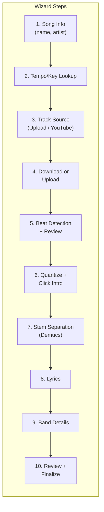

# New Song Wizard

> Historical design plan. Most items below are now implemented; where this file
> differs from current behavior, trust `README.md` and `docs/CODEX_HANDOFF.md`.

> Build a multi-step web UI wizard in the Django app that automates adding new songs. The user either uploads pre-made stems or points the wizard at a YouTube audio source -- the backend then downloads, detects beats, quantizes to a fixed tempo with a click intro, and runs Demucs AI separation to produce stems (guitar, vocals, drums, bass, other, master). The wizard also fetches song info, tempo/key, lyrics, and band details, with a final review step before publishing.

## Architecture Overview

A multi-step wizard accessible from the sidebar (login required), backed by a Django model that persists wizard state across steps. Long-running operations (downloads, beat detection, quantization, stem separation queueing) run in background threads with AJAX polling for progress. All processing happens in a staging directory; final files are moved to `SONGS_DIR` on completion.


```mermaid
flowchart LR
    subgraph wizard [Wizard Steps]
        S1["1. Song Info\n(name, artist)"]
        S2["2. Tempo/Key Lookup"]
        S3["3. Track Source\n(Upload / YouTube)"]
        S4["4. Download or\nUpload"]
        S5["5. Beat Detection\n+ Review"]
        S6["6. Quantize +\nClick Intro"]
        S7["7. Stem Separation\n(Demucs)"]
        S8["8. Lyrics"]
        S9["9. Band Details"]
        S10["10. Review +\nFinalize"]
    end
    S1 --> S2 --> S3 --> S4 --> S5 --> S6 --> S7 --> S8 --> S9 --> S10
```

## New Dependencies

Add to `requirements.txt`:

- **yt-dlp** -- YouTube search and audio download
- **librosa** -- beat tracking, onset detection, tempo estimation (pulls in `numpy`, `scipy`, `soundfile`)
- **pyrubberband** -- high-quality time-stretching (Python bindings for Rubber Band Library)
- **demucs** -- Meta's AI stem separation model (splits a mix into vocals, drums, bass, guitar, keys). Pulls in `torch`; the `htdemucs_6s` model is the 6-stem variant needed here.
- System dependency: **rubberband-cli** (`brew install rubberband` on macOS, `apt install rubberband-cli` on Debian) -- required by pyrubberband

Note: `demucs` + `torch` is a large dependency (~2 GB). It can be made optional -- the wizard detects whether it's installed and only shows the Demucs option if available.

No task queue (Celery, etc.) needed. Background work uses `threading.Thread` with progress stored in the DB, polled via AJAX -- consistent with existing vanilla Django patterns.

## Data Model

New model in `player/models.py`:

```python
class SongWizard(models.Model):
    STEP_CHOICES = [
        ('song_info', 'Song Info'),
        ('tempo_key', 'Tempo/Key Lookup'),
        ('track_source', 'Track Source'),
        ('download_upload', 'Download / Upload'),
        ('beat_detect', 'Beat Detection'),
        ('quantize', 'Quantize + Click'),
        ('stem_separation', 'Stem Separation'),
        ('lyrics', 'Lyrics'),
        ('band_details', 'Band Details'),
        ('review', 'Review'),
        ('complete', 'Complete'),
        ('failed', 'Failed'),
    ]
    created_by = models.ForeignKey(settings.AUTH_USER_MODEL, on_delete=models.CASCADE)
    current_step = models.CharField(max_length=20, choices=STEP_CHOICES, default='song_info')
    title = models.CharField(max_length=255)
    artist = models.CharField(max_length=255)
    tempo = models.IntegerField(null=True, blank=True)
    key = models.CharField(max_length=20, blank=True, default='')
    time_signature = models.CharField(max_length=10, default='4/4')

    # How tracks were sourced: 'youtube' or 'upload'
    track_source = models.CharField(max_length=20, default='youtube')

    # YouTube selection for the master audio
    # e.g. {"video_id": "...", "title": "...", "duration": "..."}
    youtube_selection = models.JSONField(default=dict, blank=True)

    # Beat detection results: list of beat times in seconds
    detected_beats = models.JSONField(default=list, blank=True)
    adjusted_beats = models.JSONField(default=list, blank=True)

    # Band details (guitars, vocals, starts, etc.)
    band_details = models.JSONField(default=dict, blank=True)

    # Lyrics
    lyrics_content = models.TextField(blank=True, default='')
    lyric_offset_secs = models.FloatField(default=0)

    # Background task tracking
    bg_task_status = models.CharField(max_length=20, default='idle')  # idle, running, done, error
    bg_task_progress = models.IntegerField(default=0)  # 0-100
    bg_task_message = models.TextField(blank=True, default='')

    staging_dir = models.CharField(max_length=500, blank=True, default='')
    created_at = models.DateTimeField(auto_now_add=True)
    updated_at = models.DateTimeField(auto_now=True)
```

Staging files go in a new `STAGING_DIR` setting (default `<project>/.song_staging/<wizard_id>/`).

## Wizard Steps in Detail

### Step 1: Song Info

- Simple form: title, artist, time signature (default 4/4)
- Creates the `SongWizard` record

### Step 2: Tempo/Key Lookup

- **Primary source**: Spotify Web API (`/v1/search` to find the track, then `/v1/audio-features/{id}` for tempo + key + time signature). Requires `SPOTIFY_CLIENT_ID` / `SPOTIFY_CLIENT_SECRET` env vars (client credentials flow, no user OAuth).
- **Fallback**: GetSongBPM.com API (simpler, API key based) or local detection via `librosa.beat.beat_track()` and `librosa.key_to_notes()`
- Display results with editable fields so the user can override
- If no API keys configured, skip straight to manual entry

### Step 3: Track Source Selection

Two paths, chosen by the user:

**Path A -- Upload stems:**

- User uploads their own pre-made stem files (WAV, MP3, FLAC, etc.)
- Upload interface accepts multiple files with labels (Drums, Bass, Guitar, Vocals, Master, etc.)
- At minimum, a Master track is required
- Uploaded files are saved to the staging directory
- If all stems are provided, the Demucs step (Step 7) can be skipped

**Path B -- YouTube download + Demucs:**

- User searches YouTube for the song's audio using `yt-dlp` search
  - Search queries: `"{artist} {title} official audio"`, `"... audio"`, `"... official music video"`
- Display top results with thumbnail, title, duration, and channel name
- User selects one video as the source audio
- Store selection in `youtube_selection` JSON field
- Stems will be generated automatically via Demucs in Step 7

### Step 4: Download or Upload

- **YouTube path**: Use `yt-dlp` to download audio from the selected video. Format: best audio, post-process to WAV. Save as `staging_dir/Master.wav`.
- **Upload path**: Files are already in staging from Step 3. Validate and convert to WAV if needed.
- Background thread with progress updates for downloads
- UI shows a progress bar

### Step 5: Beat Detection + Review

- Run `librosa.beat.beat_track()` on the master audio
- Store detected beat times as a JSON array of float seconds
- **Interactive beat editor UI**:
  - Canvas-based waveform of the master (reuse existing waveform rendering pattern from `player/static/player/js/player.js`)
  - Vertical beat markers overlaid on the waveform at detected positions
  - Drag markers left/right to adjust timing
  - Click between markers to add a new beat
  - Right-click or shift-click to delete a marker
  - Play/pause to audition with a click sound on each marker
  - "Re-detect" button to re-run detection if results are poor
  - Beat numbers and measure groupings shown (e.g., every 4 beats highlighted for 4/4)
  - Zoom in/out for fine adjustment
- Save adjusted beats back to the model

### Step 6: Quantize + Click Intro

- **Quantization**: For the master (and any uploaded stems):
  - Split audio at adjusted beat boundaries into segments
  - Calculate each segment's actual duration vs. target duration (beat interval = 60/tempo)
  - Time-stretch each segment using `pyrubberband.pyrb.time_stretch()` to match target tempo
  - Concatenate the warped segments
  - **Prepend silence**: add exactly `click_intro_duration` seconds of silence to the start (so the music begins after the click intro)
- **Click track generation**: Generate `Click.ogg` that is the full song duration (including intro):
  - 8 beats of audible click during the intro (2 bars of 4/4 at the target tempo)
  - Accented click (higher pitch, e.g., 1000 Hz) on beat 1 of each bar, normal click (800 Hz) on beats 2-4
  - Continue the click through the entire song (so musicians can hear the grid while playing)
  - Render as OGG Opus using ffmpeg (consistent with the existing lossy audio pipeline)
- Background thread with progress
- Output: quantized WAV files + `Click.ogg` in staging directory
- UI shows before/after playback comparison

### Step 7: Stem Separation (Demucs)

- **YouTube path**: Run Demucs `htdemucs_6s` model on the quantized master to produce 6 stems: Vocals, Drums, Bass, Guitar, Other/Keys, plus keep the quantized Master
- **Upload path with all stems**: Skip this step (user already provided stems, and they were quantized in Step 6)
- **Upload path with master only**: Run Demucs on the quantized master, same as the YouTube path
- Background thread with progress (Demucs logs progress per step)
- Output: `staging_dir/Vocals.wav`, `Drums.wav`, `Bass.wav`, `Guitar.wav`, `Keys.wav`, `Master.wav`
- Demucs option is only available if `demucs` is importable (graceful degradation)

### Step 8: Lyrics

- Reuse logic from `download_lyrics.py` (`search_lyrics()` function) to query LRCLIB
- Display synced lyrics in a text area for review/edit
- Auto-calculate lyric offset from the click intro: `click_intro_duration = (beats_per_bar * bars_of_intro) * (60 / tempo)`
  - For 4/4 with 2-bar intro: `8 * (60 / tempo)` seconds
- Apply offset to all LRC timestamps automatically
- User can adjust offset manually
- The `lyric_offset` field in `info.json` gets set to this value

### Step 9: Band Details

- Form matching the existing `info.json` structure:
  - **Guitars**: lead (type, tuning, capo), rhythm (type, tuning, capo), bass (tuning)
  - **Vocals**: lead (multi-select from band members), backing (multi-select)
  - **Starts**: who starts the song, what they start with
- Band member names should be configurable (stored in `SiteSettings` or a new model, prepopulated from existing songs)

### Step 10: Review + Finalize

- Summary of everything: title, artist, tempo, key, stems list, lyrics preview, band details
- Playback preview of the final stems with click track
- "Create Song" button:
  - Generates `info.json` from all collected metadata (including `lyric_offset`)
  - Writes `lyrics.lrc` with offset applied
  - Copies audio files + `Click.ogg` to `SONGS_DIR/{Artist} - {Title}/`
  - Cleans up staging directory
  - Marks wizard as `complete`
- Redirect to the new song's player page

## URL Structure

All under `/songs/new/` prefix, login-required:

- `/songs/new/` -- start wizard (or resume in-progress)
- `/songs/new/<wizard_id>/step/<step_name>/` -- each step page
- `/api/songs/new/<wizard_id>/youtube-search/` -- AJAX: YouTube search
- `/api/songs/new/<wizard_id>/download/` -- AJAX: start download
- `/api/songs/new/<wizard_id>/upload/` -- AJAX: upload stems
- `/api/songs/new/<wizard_id>/demucs/` -- AJAX: start Demucs separation
- `/api/songs/new/<wizard_id>/detect-beats/` -- AJAX: start beat detection
- `/api/songs/new/<wizard_id>/quantize/` -- AJAX: start quantization
- `/api/songs/new/<wizard_id>/task-status/` -- AJAX: poll background task progress
- `/api/songs/new/<wizard_id>/beats/` -- GET/PUT beat positions
- `/api/songs/new/<wizard_id>/stem-audio/<stem_name>/` -- serve staging audio for playback

## UI / Navigation

- New "Add Song" button on the song list page for logged-in users, like the existing ZIP upload but routes to the wizard
- New sidebar item or sub-item under existing navigation
- Wizard uses a stepped progress indicator at the top (step 1 of 10, with step names)
- Each step has Back / Next navigation
- Consistent with existing dark theme and CSS patterns in `player/static/player/css/style.css`

## File Structure (new files)

- `player/wizard_views.py` -- all wizard views (keeps `views.py` from growing further)
- `player/wizard_services.py` -- business logic: YouTube search/download, Demucs, beat detection, quantization, click generation, lyrics
- `player/templates/player/wizard/` -- templates for each step
- `player/static/player/js/beat_editor.js` -- interactive beat editor component (Canvas waveform + draggable markers)
- `player/static/player/js/wizard.js` -- wizard UI logic (progress polling, step navigation)

## Implementation Phases

Given the complexity, this should be built incrementally. Each phase produces a working subset:

- **Phase A**: Foundation + Steps 1-2 (model, migration, wizard shell with step indicator, song info form, tempo/key lookup via Spotify or manual)
- **Phase B**: Steps 3-4 (Track source selection UI -- upload interface and YouTube search with result cards, background download with progress)
- **Phase C**: Step 5 (beat detection + interactive beat editor -- the hardest frontend work)
- **Phase D**: Step 6 (quantization engine, silence prepend on all stems/master, Click.ogg generation -- the hardest backend work)
- **Phase E**: Step 7 (Demucs stem separation on the quantized master, with progress tracking and graceful fallback if Demucs is unavailable)
- **Phase F**: Steps 8-10 (lyrics with auto-offset, band details form, review/finalize with full preview playback)

## Key Risks and Mitigations

- **Beat detection accuracy**: `librosa` beat tracking is good but not perfect, especially for songs with complex rhythms. The semi-automated review step mitigates this -- the user corrects misdetections.
- **Time-stretch quality**: Rubber Band is the gold standard, but extreme stretch ratios (>15% change) can produce artifacts. Most pop/rock songs vary within 5% of their nominal tempo, so this should be fine.
- **Demucs quality**: AI separation is imperfect -- there will be bleed between stems. For rehearsal/practice purposes this is usually acceptable. The upload path provides an alternative when cleaner stems are available.
- **Demucs dependency size**: `torch` + `demucs` is ~2 GB. Making it optional (import check) means the app works without it, just without the AI separation feature.
- **yt-dlp breakage**: YouTube frequently changes its API; `yt-dlp` is actively maintained but may need periodic updates.
- **Spotify API access**: Requires developer credentials. The plan includes fallback to manual entry if unconfigured.
